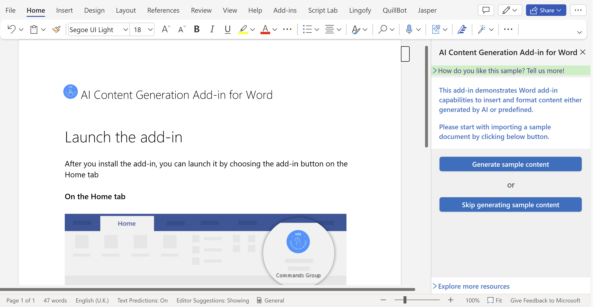
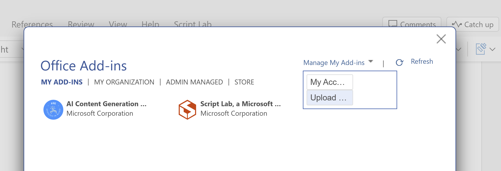

# Create a Word Add-in that produces content

[](https://github.com/microsoftgraph/msgraph-training-office-addin/actions/workflows/node.js.yml) 

This sample shows a practical Word Add-in with content insertion features, utilizing either AI or predefined content. 

## How the sample add-in works
### Features
- Import the document template
- Incorporate content generated by the Azure OpenAI service or predefined titles, comments, and footnotes into the Word document
- Customize the document style
- Insert predefined image into the document

### Play the sample add-in demo
Click the button below and play the sample add-in demo:<br><br>
[](https://office.live.com/start/Word.aspx?culture=en-US&omextemplateclient=Word&omexsessionid=0a1dfc7b-e965-4436-a8a0-2cb908ca19ea&omexcampaignid=none&templateid=WA200006289&templatetitle=AI%20Content%20Generation%20Add-in%20for%20Word&omexsrctype=1)
<br><br>
When you click the button, you will open Word online in a new browser tab, and the sample add-in will launch automatically.
#### Note：
- You need to have a Microsoft 365 account to try the sample. You can [sign up for the Microsoft 365 Developer Program](https://developer.microsoft.com/microsoft-365/dev-program) to get a free Microsoft 365 subscription.
- [Optional] If you're interested in exploring AIGC, follow the procedure to request an Azure OpenAI service account. Find more details at [Deploy a model and generate text using Azure OpenAI Service](https://learn.microsoft.com/en-us/azure/ai-services/openai/quickstart?tabs=command-line%2Cpython&pivots=rest-api)

### Expected result


## Build, run and debug the sample code 
### Manually run on your local machine
To run the sample on desktop, please follow the detailed steps provided below.
1. Install a recent version of [npm](https://www.npmjs.com/get-npm) and [Node.js](https://nodejs.org/) on your computer. To verify if you've already installed these tools, run the commands `node -v` and `npm -v` in your terminal.
2. Clone the repo to your local workspace or directly download the source code.
3. Open the project in Visual Studio Code.
4. [Optional] If you're interested in exploring AIGC, with prerequisites all satisfied, you can fill in the parameters apiKey, endpoint and deployment in `src/taskpane/components/utility/AIData.tsx` to persist the Azure OpenAI account. Or you can skip this step if you just want to try the predefined functionality.
6. cd src folder and execute following commands:
    ```console
    npm install
    npm start
    ```
7. Start debugging the project by hitting the `F5` key in Visual Studio Code.

### Sideload the sample add-in on Word Online
The previous steps show you how to run our sample on desktop. As for the Word Online, please follow the following steps to sideload the manifest.xml file on web.
1.  Keep the webpack server on to host your sample add-in.
1.  Open [Office on the web](https://office.live.com/).
1.  Choose **Word**, and then open a new document.
1.  On the **Home** tab, in the **Add-ins** section, choose **Add-ins** and click **More Add-ins** on the lower-right corner to open Add-in Store Page.
1.  On the **Office Add-ins** dialog, select the **MY ADD-INS** tab, choose **Manage My Add-ins**, and then **Upload My Add-in**.
    
1.  Browse to the add-in manifest file, and then select **Upload**.
1.  Verify that the add-in loaded successfully. 

## Additional resources
You may explore additional resources at the following links:
- More samples: [Office Add-ins code samples](https://github.com/OfficeDev/Office-Add-in-samples)
- Office add-ins documentation: [Office Add-ins documentation](https://learn.microsoft.com/en-us/office/dev/add-ins/)

## Feedback
Did you experience any problems with the sample? [Create an issue]( https://github.com/OfficeDev/Word-Scenario-based-Add-in-Samples/issues/new) and we'll help you out.

## Copyright
Copyright (c) 2021 Microsoft Corporation. All rights reserved.
This project has adopted the [Microsoft Open Source Code of Conduct](https://opensource.microsoft.com/codeofconduct/). For more information, see the [Code of Conduct FAQ](https://opensource.microsoft.com/codeofconduct/faq/) or contact [opencode@microsoft.com](mailto:opencode@microsoft.com) with any additional questions or comments.
**Note**: The taskpane.html file contains an image URL that tracks diagnostic data for this sample add-in. Please remove the image tag if you reuse this sample in your own code project.


